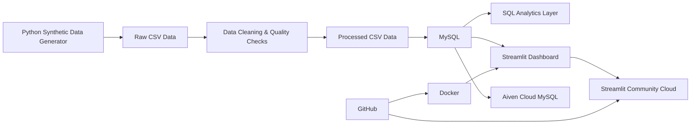

# B2B SaaS Growth Analytics

An end-to-end B2B SaaS analytics platform demonstrating **data generation, data quality, ETL, relational analytics, cloud database deployment, dashboarding, Docker, and automated pipeline execution**.

## 🚀 Live Demo

**Streamlit dashboard:**  
https://b2b-saas-growth-analytics-qsggxqtvt2au7l4rvbndb2.streamlit.app/

> The project uses synthetic data. The dashboard is intended as a portfolio demonstration of an analytics engineering workflow.

---

## 🎯 Business Problem

A B2B SaaS company needs a repeatable analytics system to answer questions such as:

- How much revenue is being generated?
- What are MRR and ARR?
- How many subscriptions are active or cancelled?
- What is the subscription churn rate?
- Which plans and industries generate the most revenue?
- Which customers generate the most revenue?
- How is product usage changing over time?
- Can customer, subscription, transaction and usage data be brought together into a reliable analytics layer?

This project builds the complete pipeline required to answer those questions.

---

## 🏗️ Architecture



### Data flow

```text
Python
  ↓
Generate synthetic SaaS data
  ↓
Raw CSV files
  ↓
Cleaning + validation
  ↓
Processed CSV files
  ↓
MySQL
  ↓
SQL analytics
  ↓
Streamlit dashboard
  ↓
Docker / Streamlit Community Cloud
```

---

## 🧰 Tech Stack

| Layer | Technology |
|---|---|
| Programming | Python 3.13 |
| Data processing | Pandas, NumPy |
| Database | MySQL 8 |
| Cloud database | Aiven MySQL |
| Analytics | SQL |
| Dashboard | Streamlit |
| Application database access | SQLAlchemy + PyMySQL |
| Configuration | python-dotenv + Streamlit Secrets |
| Containerization | Docker |
| Development | VS Code |
| Version control | Git + GitHub |
| Deployment | Streamlit Community Cloud |

---

## 📊 Dataset

The project generates a synthetic B2B SaaS dataset covering 2025.

### Tables

| Table | Rows | Purpose |
|---|---:|---|
| `customers` | 1,000 | Customer/company attributes |
| `subscriptions` | 1,000 | Subscription plans, prices and status |
| `transactions` | 7,057 | Revenue transactions |
| `product_usage` | 7,402 | Monthly product engagement |

The dataset intentionally contains several data-quality problems so the cleaning stage demonstrates realistic ETL work:

- Missing country
- Missing industry
- Inconsistent country casing
- Inconsistent industry casing
- Duplicate transaction record

---

## 🔄 Automated Pipeline

Run the entire pipeline with:

```bash
python -m src.pipeline
```

The pipeline executes:

```text
1. Generate raw data
        ↓
2. Clean and validate data
        ↓
3. Load processed data into MySQL
```

Latest successful pipeline run:

```text
Customers:       1,000
Subscriptions:   1,000
Transactions:    7,057
Product Usage:   7,402
```

---

## 🧹 Data Quality

The cleaning pipeline performs:

- Missing-value handling
- Text standardization
- Date conversion
- Numeric type conversion
- Subscription status normalization
- Transaction type normalization
- Duplicate transaction removal
- Row-count verification
- Null-count reporting

The raw data is intentionally imperfect; the processed layer is the trusted analytics input.

---

## 📈 Dashboard KPIs

The deployed dashboard currently exposes:

- Total Revenue
- MRR
- ARR
- Churn Rate
- Customer Count
- Active Subscriptions
- Transaction Count
- Estimated LTV
- Revenue Trend
- Revenue by Transaction Type
- Revenue by Plan
- Customers by Industry
- Subscription Performance
- Product Usage
- Top Customers by Revenue
- Average Revenue per Paying Customer
- Average Customer Lifetime

Current dashboard output from the synthetic dataset:

| KPI | Value |
|---|---:|
| Total Revenue | $5,294,338.50 |
| MRR | $691,730.00 |
| ARR | $8,300,760.00 |
| Churn Rate | 13.00% |
| Customers | 1,000 |
| Active Subscriptions | 870 |
| Transactions | 7,057 |
| Estimated LTV | $23,400.98 |

---

## 🧮 Metric Definitions

### MRR

Monthly recurring revenue from active subscriptions:

```text
MRR = Sum of monthly_price for active subscriptions
```

### ARR

```text
ARR = MRR × 12
```

### Churn Rate

This demonstration uses:

```text
Churn Rate = Cancelled subscriptions / Total subscriptions × 100
```

### Estimated LTV

The dashboard uses a simplified demonstration estimate:

```text
Estimated LTV =
Average Revenue per Paying Customer
×
Average Customer Lifetime in Months
```

These are portfolio/demo definitions rather than production finance definitions.

---

## 🗄️ SQL Analytics

The `sql/` directory contains four analytical modules:

| File | Purpose |
|---|---|
| `01_core_revenue_metrics.sql` | Core revenue and subscription KPIs |
| `02_customer_subscription_analytics.sql` | Customer and subscription analysis |
| `03_product_usage_analytics.sql` | Product engagement analysis |
| `04_customer_kpi_analysis.sql` | Customer-level KPI mart queries |

The customer KPI analysis explicitly pre-aggregates transactions and product usage before joining them. This prevents **many-to-many row multiplication**, which would otherwise inflate revenue and distort usage metrics.

---

## ☁️ Cloud Architecture

Production-style deployment:

```text
GitHub
   │
   ├── Streamlit Community Cloud
   │         │
   │         └── dashboard/app.py
   │
   └── Source code / version control

Streamlit Community Cloud
   │
   │ secure secrets
   ↓
Aiven MySQL
   │
   ├── customers
   ├── subscriptions
   ├── transactions
   └── product_usage
```

The database credentials are **not stored in GitHub**. Local development uses `.env`, while Streamlit Community Cloud uses encrypted Secrets.

---

## 🐳 Docker

Build the dashboard image:

```bash
docker build -t b2b-saas-dashboard .
```

Run locally:

```bash
docker run --env-file .env -e DB_HOST=host.docker.internal -p 8501:8501 b2b-saas-dashboard
```

Open:

```text
http://localhost:8501
```

---

## 💻 Local Setup

Create the virtual environment:

```bash
py -3.13 -m venv .venv
```

Activate it in PowerShell:

```powershell
Set-ExecutionPolicy -Scope Process -ExecutionPolicy Bypass
.venv\Scripts\Activate.ps1
```

Install dependencies:

```bash
pip install -r requirements.txt
```

Configure `.env`:

```text
DB_HOST=localhost
DB_PORT=3306
DB_USER=root
DB_PASSWORD=YOUR_LOCAL_MYSQL_PASSWORD
DB_NAME=b2b_saas_analytics
```

Run the complete pipeline:

```bash
python -m src.pipeline
```

Run the dashboard:

```bash
streamlit run dashboard/app.py
```

---

## 📁 Project Structure

```text
B2B_SaaS_Growth_Analytics/
│
├── dashboard/
│   └── app.py
│
├── data/
│   ├── raw/
│   └── processed/
│
├── notebooks/
│
├── sql/
│   ├── 01_core_revenue_metrics.sql
│   ├── 02_customer_subscription_analytics.sql
│   ├── 03_product_usage_analytics.sql
│   └── 04_customer_kpi_analysis.sql
│
├── src/
│   ├── config.py
│   ├── generate_data.py
│   ├── clean_data.py
│   ├── load_database.py
│   └── pipeline.py
│
├── tests/
│
├── .dockerignore
├── .gitignore
├── Dockerfile
├── README.md
└── requirements.txt
```

Database backups are intentionally excluded from Git with `*.sql` protection, while analytical SQL files inside `sql/` remain tracked.

---

## 🔐 Security

Sensitive credentials are never committed to GitHub.

Local:

```text
.env
```

Cloud:

```text
Streamlit Secrets
```

The `.gitignore` excludes `.env`, generated data and database backup files.

---

## 🧠 Engineering Decisions

### Why MySQL?

The project models a relational SaaS environment where customers, subscriptions, transactions and product usage have clear relationships.

### Why SQL?

SQL provides the analytical layer used to calculate business KPIs and demonstrate relational data modeling.

### Why Streamlit?

Streamlit provides a fast way to turn the analytics layer into an interactive business-facing application.

### Why Docker?

Docker makes the dashboard environment reproducible and demonstrates containerization skills.

### Why Aiven?

Aiven provides a managed cloud MySQL service, allowing the dashboard to connect to a remotely hosted relational database rather than only a local database.

---

## 🧪 Data Quality Engineering

The project deliberately separates:

```text
Raw data
   ↓
Cleaning
   ↓
Processed data
   ↓
Database
   ↓
Analytics
```

This separation makes the pipeline easier to test, debug and reproduce.

---

## 📌 Project Status

### Completed

- [x] Python environment
- [x] Synthetic data generation
- [x] Data-quality issues
- [x] Data cleaning
- [x] MySQL database
- [x] SQL analytics
- [x] Automated ETL pipeline
- [x] Streamlit dashboard
- [x] Docker container
- [x] Aiven cloud database
- [x] Streamlit Community Cloud deployment
- [x] GitHub version control
- [x] Cloud dashboard connected to Aiven
- [x] Production-style secrets management

### Portfolio Outcome

This project demonstrates an end-to-end analytics engineering workflow rather than only a notebook or static dashboard:

**Generate → Clean → Validate → Load → Analyze → Containerize → Deploy → Serve live analytics**

---

## 👩‍💻 Author

**Arjavi Shetye**

B.Com graduate transitioning into AI Engineering / Data & ML Engineering.

GitHub:  
https://github.com/arjavianup523
